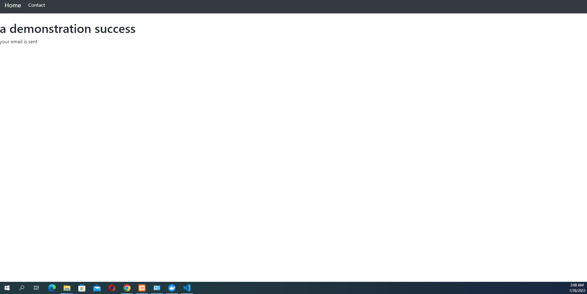

# Email testing with Maildev and Slim Framework 
this is a simple MIT application which make you able to verify your mailing setting in localhost. <br>



## Requirements 
PHP > 7.1.^
npm or docker 


## installations 
```
git clone https://github.com/toof06/Slim3-mailVerification.git
```
```
npm i maildev
```
### OR 
```
docker run -p 1080:1080 -p 1025:1025 maildev/maildev
```
```
php -S localhost:8080 -t public\    you must choose the port who isn't used
```

## PS. you can install Maildev through npm or docker but docker is more efficient


